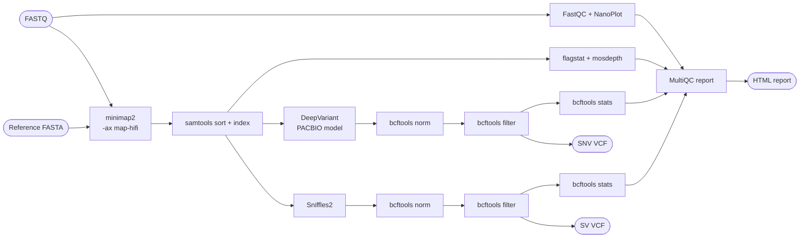

# nfcore-longread-varcall

```
   ┌──────────────────────────────────────────────────────────────────┐
   │                                                                  │
   │   nfcore-longread-varcall  ·  PacBio HiFi → variants  ·  v0.1.0  │
   │                                                                  │
   └──────────────────────────────────────────────────────────────────┘
```

[](https://www.nextflow.io/)
[](https://www.docker.com/)
[](https://sylabs.io/singularity/)
[](LICENSE)
[](https://github.com/abyanhussain21-sudo/nfcore-longread-varcall/actions/workflows/ci.yml)
[](.github/workflows/ci.yml)
[](https://github.com/abyanhussain21-sudo)

---

A Nextflow DSL2 pipeline for haplotype-aware variant calling from PacBio HiFi long reads on non-model mammalian genomes. It maps HiFi reads with `minimap2 -ax map-hifi`, calls SNVs/indels with DeepVariant's PACBIO model, calls structural variants with Sniffles2, and aggregates QC into a single MultiQC report. The pipeline follows nf-core conventions — modular processes, container directives, channel-based meta maps, CI testing, parameter schema — but is published on a personal GitHub account, not under the nf-core organisation.

## Pipeline overview



## Quickstart

```bash
# 1. Get the pipeline
git clone https://github.com/abyanhussain21-sudo/nfcore-longread-varcall.git
cd nfcore-longread-varcall

# 2. Generate the synthetic test data (one-off; deterministic)
python3 bin/make_test_data.py --outdir tests/test_data

# 3. Run the test profile
nextflow run . -profile test,docker
```

Total runtime on a laptop: under 5 minutes. Outputs land in `./results-test/`.

If Docker isn't available, fall back to `-profile test,conda`.

## Usage

### Samplesheet

A CSV with three columns. Paths can be absolute or relative.

```csv
sample_id,fastq,reference
CHILL_BULL_01,data/chill_bull_01.hifi.fastq.gz,reference/btau_arsucd1.2.fa
CHILL_BULL_02,data/chill_bull_02.hifi.fastq.gz,reference/btau_arsucd1.2.fa
```

The Python validator in `bin/check_samplesheet.py` checks the header, sample-id format, file extensions, and that every referenced file exists. Errors are reported as `row N: <reason>` rather than as Python tracebacks.

Full samplesheet specification: [docs/usage.md](docs/usage.md).

### Real run

```bash
nextflow run abyanhussain21-sudo/nfcore-longread-varcall \
    --input samplesheet.csv \
    --reference reference.fa \
    --outdir results \
    -profile docker
```

### Stage toggles

| Flag | Effect |
|------|--------|
| `--skip_snv` | Skip DeepVariant. |
| `--skip_sv` | Skip Sniffles2. |
| `--skip_qc` | Skip FastQC + NanoPlot. |
| `--skip_multiqc` | Skip the MultiQC report. |

## Parameters

| Param | Default | Notes |
|-------|---------|-------|
| `--input` | — | Required samplesheet CSV. |
| `--outdir` | `./results` | Where outputs land. |
| `--reference` | — | Optional global reference; per-sample references in the samplesheet take precedence. |
| `--min_qual` | 20 | Min QUAL kept by `bcftools filter`. |
| `--min_dp` | 10 | Min INFO/DP kept. |
| `--deepvariant_model_type` | `PACBIO` | `PACBIO`, `WGS`, `WES`, `ONT_R104`, `HYBRID_PACBIO_ILLUMINA`. |
| `--max_cpus` | 16 | Resource ceiling. |
| `--max_memory` | `64.GB` | Resource ceiling. |
| `--max_time` | `24.h` | Resource ceiling. |

Full list with types and validation rules: [docs/parameters.md](docs/parameters.md).

## Outputs

```
results/
├── qc/                  FastQC, NanoPlot, samtools flagstat, mosdepth
├── alignment/           sorted BAMs + indices
├── variants/snv/        DeepVariant VCFs: raw → norm → filtered + stats
├── variants/sv/         Sniffles2 VCFs: raw → norm → filtered + stats
├── multiqc/             aggregated HTML report
└── pipeline_info/       Nextflow execution report, timeline, trace, DAG
```

What each file contains: [docs/output.md](docs/output.md).

## Why I built this

I am an MSc Bioinformatics student at Edinburgh whose thesis at the Roslin Institute uses PacBio HiFi for long-read variant calling on the MHC class region in Chillingham wild cattle. My existing analysis pipelines for the thesis are in Snakemake. I built this pipeline to:

1. Reproduce the same analysis logic in Nextflow DSL2 so I have hands-on competence with the workflow language used at Sanger, the Crick, Genomics England, AstraZeneca, and most UK genomics employers.
2. Demonstrate that I can ship a pipeline that follows nf-core conventions — modular processes, container support, CI testing, reproducible test profiles, parameter schemas — without hand-waving the parts that take effort.
3. Document the design decisions transparently so a recruiter or PI can audit my reasoning. Every config choice is commented; every tool exception (DeepVariant container, lint waivers) is explained in the file where the decision lives, not buried in a wiki.

Reproducing what I already had in Snakemake also surfaced concrete differences between the two systems: how channels propagate metadata vs how Snakemake's wildcards do; how `ext.args` decouples flags from process definitions vs Snakemake's `params:` block; how nf-core's resource labels centralise compute requests. I would not have learned those by reading docs.

## What this pipeline is NOT

- Not currently submitted to nf-core proper. It follows nf-core conventions; it is not in the nf-core organisation. The README, file layout, and lint config make this explicit.
- Not benchmarked against Genome-in-a-Bottle. The truth file in `tests/test_data/` is a smoke-test fixture, not a recall benchmark — see [tests/README.md](tests/README.md) for the explicit framing.
- Not tuned for non-mammalian or short-read data. The defaults (`map-hifi`, `PACBIO` model, mosdepth bin size) assume mammalian HiFi.
- Test profile uses synthetic data, not real PacBio HiFi from a public dataset.

## What I would add next

- Genome-in-a-Bottle benchmarking on HG002 chr22 with hap.py / vcfeval, with a pinned truth set and a reported precision/recall in the README.
- Optional read phasing with WhatsHap, plumbed in as a subworkflow toggleable with `--phase`.
- Optional methylation calling from HiFi (`primrose`/`pb-CpG-tools`).
- A `test_full` profile pointing at a real public HiFi sample on `s3://`, run on AWS megatests as the nf-core community pipelines do.
- Joint-calling across multiple samples for cohort studies.

## Citations

A complete list of tools used and their citations lives in [CITATIONS.md](CITATIONS.md). If you use this pipeline, please cite Nextflow, the nf-core conventions, and the tools you actually relied on for your downstream analysis.

---

**Author**

[Abyan Hussain](https://github.com/abyanhussain21-sudo) — MSc Bioinformatics, University of Edinburgh.
GitHub: [@abyanhussain21-sudo](https://github.com/abyanhussain21-sudo) · LinkedIn: <https://www.linkedin.com/in/abyanhussain> (replace this URL if your handle differs)

Released under the [MIT License](LICENSE). © 2026 Abyan Hussain.
